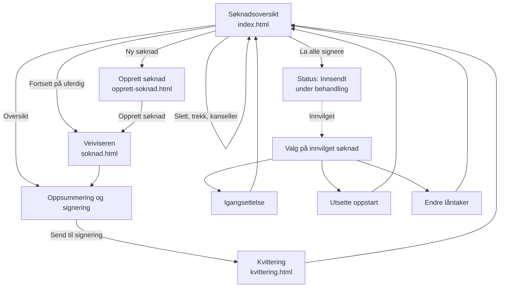
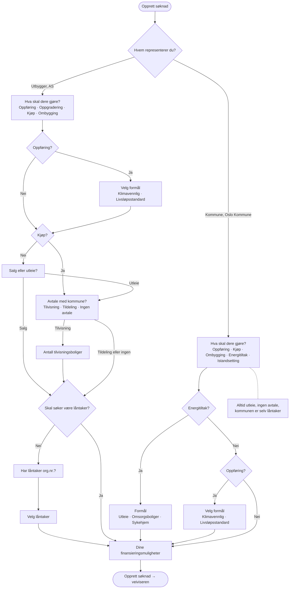
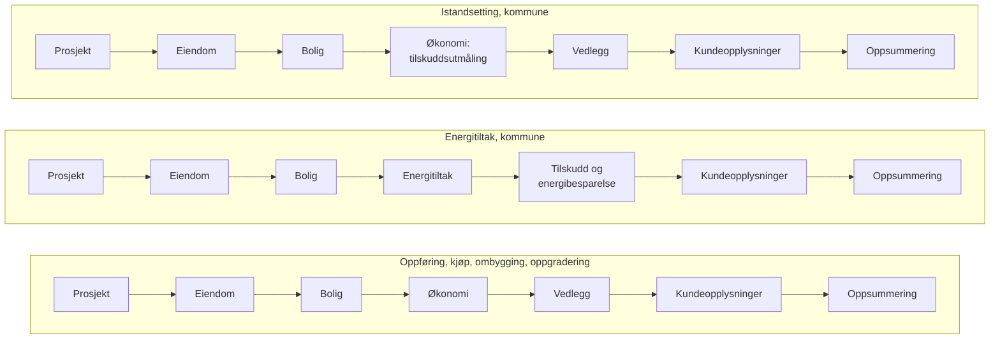
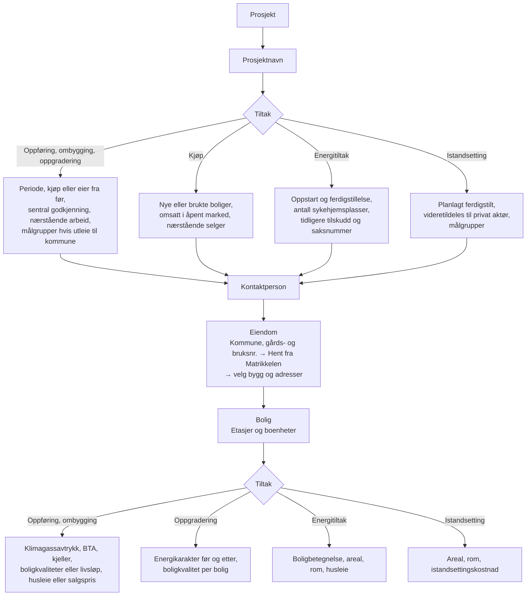
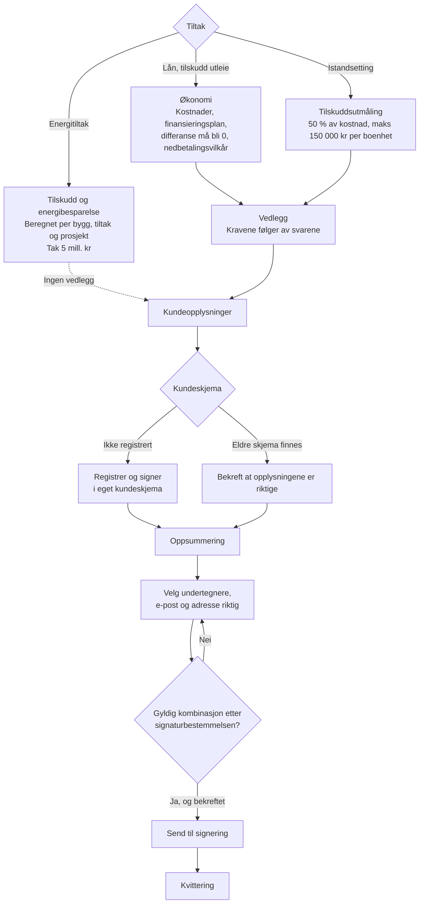
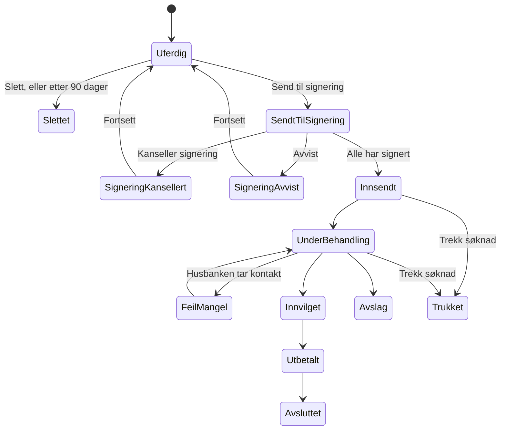

# Flyter i e-søknaden

Diagrammene vises som grafikk på GitHub og i de fleste Markdown-visere.

## 1. Hele reisen

## 2. Opprett søknad, per kundetype

Finansieringsmulighetene som tilbys:

| Tiltak | Kan søke om |
| --- | --- |
| Oppføring, kjøp, ombygging, oppgradering | Lån, og tilskudd til utleieboliger (utbygger bare ved tildelingsavtale, og ikke ved oppgradering) |
| Energitiltak (kommune) | Tilskudd til energitiltak |
| Istandsetting (kommune) | Tilskudd til istandsetting |

## 3. Stegene i veiviseren, per tiltak

Ved energitiltak med formål **sykehjem** og flere enn 0 sykehjemsplasser hoppes Bolig-steget over.

## 4. Innholdet i hvert steg

## 5. Økonomi, vedlegg og innsending

## 6. Status på en søknad

